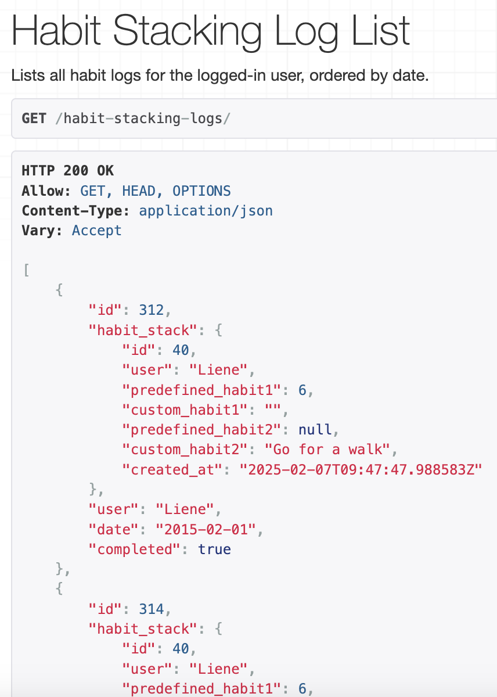
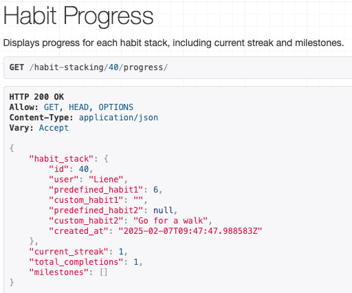
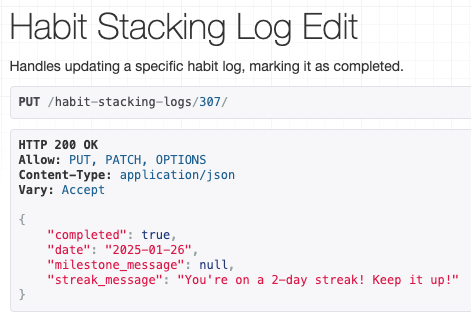
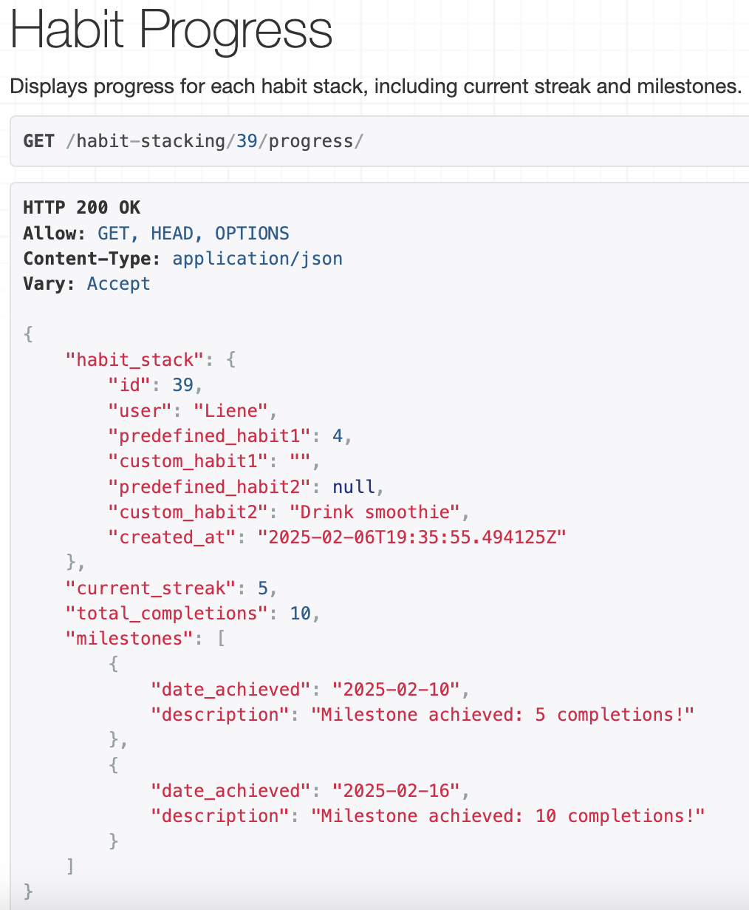
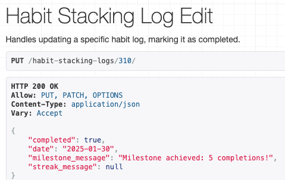
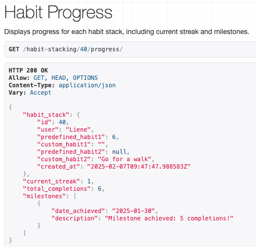
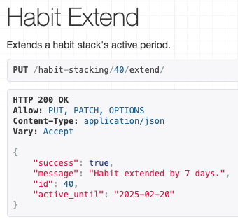
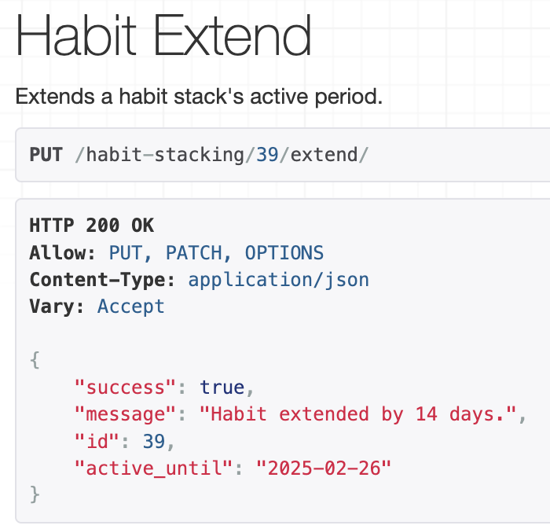
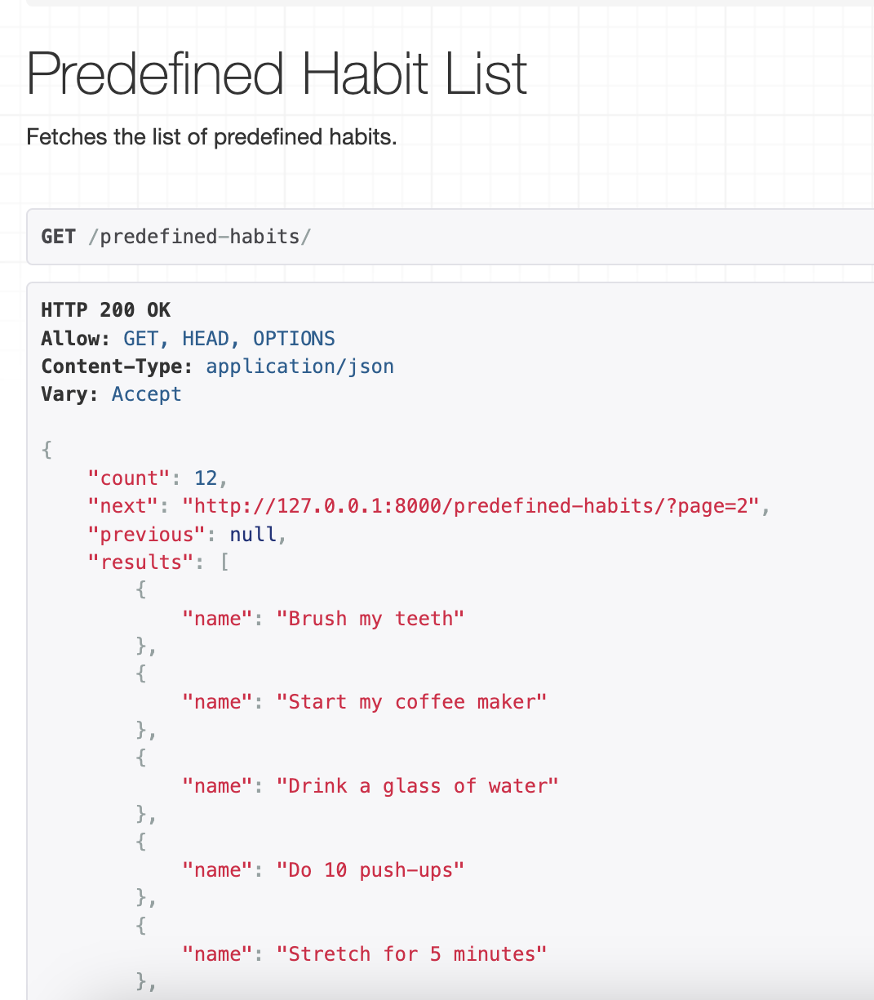

# Manual Testing

## Authorisation

## Profile

## HabitStacking API

| API Endpoint | Test Case | Expected Outcome | Actual Result |
| ------------ | --------- | ---------------- | ------------- |
|POST `/habit-stacking/`| Users can select predefined habits while creating their habit stacks. | Successful creation of a habit stack with predefined habits. | |
|POST `/habit-stacking/`| Users can have the option to enter custom habits manually. | Successful creation of a habit stack with custom habits. ||
|POST `/habit-stacking/`| If the habit stack already exists for the user with the same details, return a 400 Bad Request with a duplicate error message. | Return 400 Bad Request with error message. ||
|POST `/habit-stacking/`| Attempt to create a habit stack with both predefined and custom values for a single habit raises an error. | Return 400 Bad Request with validation error message. ||
|POST `/habit-stacking/`|Create habit stacks and see logs created automatically.| 7 logs for the next 7 days are created, each with `completed=False` by default.||
|GET `/habit-stacking/`| The authenticated user can view a list of all their habit stacks. | Return 200 OK with a list of habit stacks and habit stack details for the logged-in user. ||
|GET `/habit-stacking/{id}/`| The user can retrieve details of their specific habit stack. | Return 200 OK with habit stack details. ||
|GET `/habit-stacking/{id}/`| Return 404 Not Found if the habit stack doesn’t exist.| Return 404 Not Found.||
|PUT `/habit-stacking/{id}/`| The user can update details of their existing habit stacks. | Return 200 OK with updated habit stack details. ||
|DELETE `/habit-stacking/{id}/`| The user can delete their own habit stacks. | Return 204 No Content on successful deletion. ||
|GET `habit-stacking-logs`|List all habit stacking logs for the authenticated user.|Return 200 OK with a list of logs for the authenticated user, including habit_stack, date, and completed||
| PATCH `habit-stacking-logs/<int:pk>/`|Update the completed status of a habit stacking log (mark as complete or undo).|Return 200 OK with the updated log reflecting the completed status.||
| PATCH `habit-stacking-logs/<int:pk>/`| Attempt to mark a habit stack complete in future time raises an error.| Returns a 400 Bad Request and a validation message.| |
|GET `/habit-stacking/<int:pk>/progress/`| Retrieves detailed progress of the habit stack, updating accurately after each completion.|Progress view reflects changes correctly.|
|PATCH `/habit-stacking-logs/<int:pk>/`|Displays a streak message starting from the second consecutive completion.| After the second completion, there is a streak message "You're on a 2-day streak! Keep it up!"| 
|GET `/habit-stacking/<int:pk>/progress/`|Shows milestone achievements after 5 and 10 completions. | Completing 5 and 10 logs triggers milestone updates in the progress view.| |
|PATCH `/habit-stacking-logs/<int:pk>/`|Displays a milestone message after five completions.| After five completions there is a milestone message "Milestone achieved: 5 completions!"| 
|PATCH `/habit-stacking-logs/<int:pk>/`|Restarts the streak from 1 after a reset due to missed completions. |Completing a log after a reset sets the streak back to 1.|
| PUT `/habit-stacking/<int:pk>/extend/`| Attempt to extend with invalid data - less than 7 days|Returns 400 Bad Request with validation error message.||
| PUT `/habit-stacking/<int:pk>/extend/`|Extends the active period of a habit stack by 7 days from its current active_until date.|Returns 200 OK with active_until updated by 7 days.||
| PUT `/habit-stacking/<int:pk>/extend/`|Extends the active period of a habit stack by 14 days from its current active_until date.|Returns 200 OK with active_until updated by 14 days.||
|GET `/habit-stacking-logs/`|Verify that new logs are generated for the extended period and no duplicate logs are made.|The list of logs has been update and no duplicate logs are created| PASS|
| GET `/predefined-habits/`| Fetches the predefined habit list.| Returns 200 OK and the list of predefined habits. ||

# Automated Tests

### ProfileTests

| Test | Expected Result | Outcome |
| ---- | --------------- | ------- |
|`test_profile_created_on_user_creation`|Profile should be created automatically when a user is registered.|PASS|
|`test_user_can_retrieve_own_profile`|Users can fetch their own profile.|PASS|
|`test_user_cannot_access_other_profiles`|Users cannot access other users' profiles.|PASS|
|`test_user_can_update_own_profile`|Users can update their own profile.|PASS|
|`test_user_cannot_update_other_profiles`|Users cannot update other users' profiles.|PASS|

### HabitStackingListViewTests

| Test | Expected Result | Outcome |
| ---- | --------------- | ------- |
| `test_habit_stacking_list_view_authenticated` | Should return a list of habit stacks for the authenticated user |PASS|
| `test_habit_stacking_list_view_unauthenticated` | Should return `403 Forbidden` when an unauthenticated user tries to access |PASS|
| `test_create_habit_stack` | Should create a new habit stack for the authenticated user |PASS|
| `test_create_habit_stack_validation_error` | Should return `400 Bad Request` for invalid habit stack data |PASS|
| `test_create_habit_stack_unauthenticated` | Should return `403 Forbidden` when trying to create a habit stack without authentication |PASS|

### HabitStackingDetailViewTests

| Test | Expected Result | Outcome |
| ---- | --------------- | ------- |
| `test_habit_stacking_detail_view_authenticated` | Should return details of the habit stack for the authenticated user |PASS|
| `test_habit_stacking_detail_view_unauthenticated` | Should return `403 Forbidden` when an unauthenticated user tries to access |PASS|
| `test_habit_stacking_detail_view_forbidden` | Should return `403 Forbidden` if the habit stack belongs to another user |PASS|
| `test_update_habit_stack` | Should update the habit stack with new data |PASS|
| `test_update_habit_stack_forbidden` | Should return `403 Forbidden` when trying to update someone else’s habit stack |PASS|
| `test_delete_habit_stack` | Should delete the habit stack and return `204 No Content`|PASS|
| `test_delete_habit_stack_forbidden` | Should return `403 Forbidden` when trying to delete someone else's habit stack |PASS|

### HabitStackingLogListViewTests
| Test | Expected Result | Outcome |
| ---- | --------------- | ------- |
| `test_habit_stacking_log_list_authenticated`| Should return a list of habit stacking logs for the authenticated user. |PASS|
| `test_habit_stacking_log_list_unauthenticated`|Should return `403 Forbidden` when an unauthenticated user tries to access the habit stacking logs.|PASS|
|`test_habit_stacking_log_auto_creation_7_days`|Should automatically create 7 habit stacking logs for the authenticated user, one for each of the next 7 days, when a habit stack is created.|PASS|

### HabitStackingLogEditViewTests
| Test | Expected Result | Outcome |
| ---- | --------------- | ------- |
| `test_habit_stacking_log_update_complete`|Should update the log's completed status to True.|PASS|
|`test_habit_stacking_log_update_undo`|Should update the log's completed status back to False.|PASS|

### HabitStackingExtendAndLogTests
| Test | Expected Result | Outcome |
| ---- | --------------- | ------- |
|`test_extend_habit_stack_success`|Should successfully extend the active_until field by 7 or 14 days and return 200 OK|PASS|
|`test_extend_habit_stack_unauthenticated`|Should return 403 Forbidden for unauthenticated users attempting to extend a habit stack|PASS|
|`test_extend_habit_stack_not_found`|Should return 404 Not Found for an invalid habit stack ID|PASS|
|`test_habit_stacking_logs_updated_after_extend`|Should create new logs for the extended dates after successfully extending the habit stack|PASS|

### StreakAndMilestoneTests
| Test | Expected Result | Outcome |
| ---- | --------------- | ------- |
|`test_streak_increases_correctly`|Should correctly calculate and increase the streak for consecutive completed days|PASS|
|`test_streak_resets_after_gap`|Should reset the streak to 1 when a day is missed|PASS|
|`test_milestone_at_5_completions`|Should create a milestone when the habit is completed 5 times|PASS|
|`test_milestone_at_10_completions`|Should create a milestone when the habit is completed 10 times|PASS|
|`test_progress_view`|Should return correct streak, milestone, and completion data in the API response|PASS|

