# Manual Testing

## Authorisation

## Profile

## HabitStacking API

| API Endpoint | Test Case | Expected Outcome | Actual Result |
| ------------ | --------- | ---------------- | ------------- |
|POST `/habit-stacking/`| Users can select predefined habits while creating their habit stacks. | Successful creation of a habit stack with predefined habits. |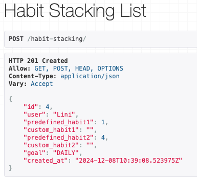 |
|POST `/habit-stacking/`| Users can have the option to enter custom habits manually. | Successful creation of a habit stack with custom habits. |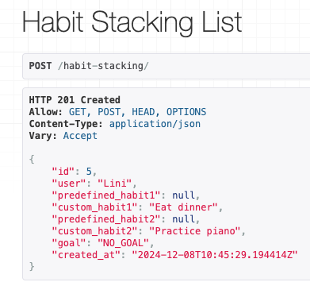|
|POST `/habit-stacking/`| If the habit stack already exists for the user with the same details, return a 400 Bad Request with a duplicate error message. | Return 400 Bad Request with error message. |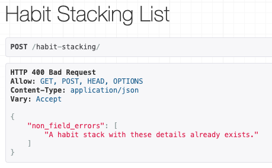|
|POST `/habit-stacking/`| Attempt to create a habit stack with both predefined and custom values for a single habit raises an error. | Return 400 Bad Request with validation error message. |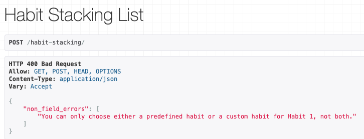|
|POST `/habit-stacking/`|Create habit stacks and see logs created automatically.| 7 logs for the next 7 days are created, each with `completed=False` by default.|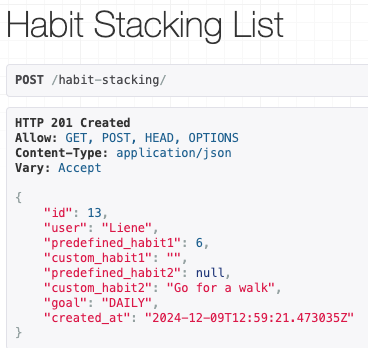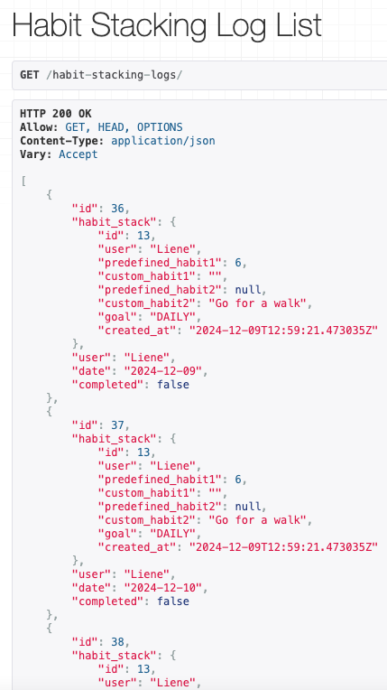|
|GET `/habit-stacking/`| The authenticated user can view a list of all their habit stacks. | Return 200 OK with a list of habit stacks for the logged-in user. |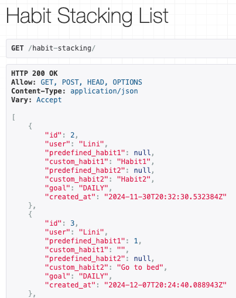|
|GET `/habit-stacking/`| Habit stacks list includes habit1, habit2. | Return 200 OK with correct habit details for each stack. |Return 200 OK with correct habit details for each stack.| PASS |
|POST `/habit-stacking/`|Create a habit stack and mark daily logs as complete for 3 consecutive days.|Streak count should increase to 3.||
|POST `/habit-stacking/`|Create a habit stack and complete logs to reach a milestone for 5 completions.|A milestone should be automatically created.|
|GET `/habit-stacking/{id}/`| The user can retrieve details of their specific habit stack. | Return 200 OK with habit stack details. ||
|GET `/habit-stacking/{id}/`| Return 404 Not Found if the habit stack doesn’t exist.| Return 404 Not Found.|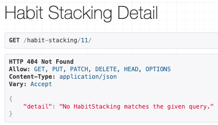|
|PUT `/habit-stacking/{id}/`| The user can update details of their existing habit stacks. | Return 200 OK with updated habit stack details. |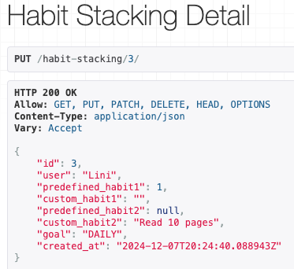|
|DELETE `/habit-stacking/{id}/`| The user can delete their own habit stacks. | Return 204 No Content on successful deletion. |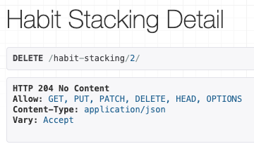|
|GET `habit-stacking-logs`|List all habit stacking logs for the authenticated user.|Return 200 OK with a list of logs for the authenticated user, including habit_stack, date, and completed|PASS|
| PATCH `habit-stacking-logs/<int:pk>/`|Update the completed status of a habit stacking log (mark as complete or undo).|Return 200 OK with the updated log reflecting the completed status.|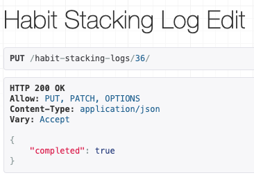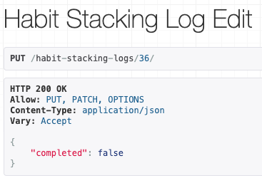|
| PATCH `habit-stacking-logs/<int:pk>/`| Attempt to mark a habit stack complete in future time raises an error.| Returns a 400 Bad Request and a validation message.| 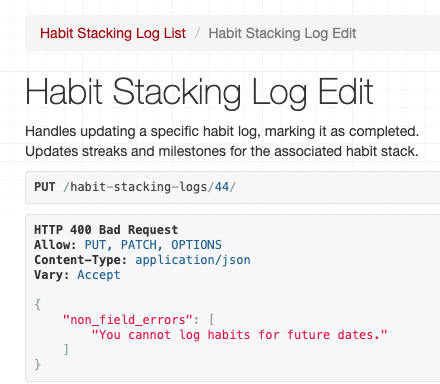|
|PATCH `/habit-stacking-logs/<int:pk>/`|Mark one day's log as incomplete during an active streak.|Streak should reset to 0.|
|PATCH `habit-stacking-logs/<int:pk>/`|Complete a log for today when no active streak exists.|Streak count starts at 1.|
| PUT `/habit-stacking/<int:pk>/extend/`| Attempt to extend with invalid data - less than 7 days|Returns 400 Bad Request with validation error message.|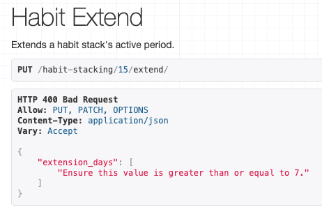|
|GET `/habit-stacking-logs/`|Verify that new logs are generated for the extended period and no duplicate logs are made.|The list of logs has been update and no duplicate logs are created| PASS|

# Automated Tests

### HabitStackingListViewTests

| Test | Expected Result | Outcome |
| ---- | --------------- | ------- |
| `test_habit_stacking_list_view_authenticated` | Should return a list of habit stacks for the authenticated user |PASS|
| `test_habit_stacking_list_view_unauthenticated` | Should return `403 Forbidden` when an unauthenticated user tries to access |PASS|
| `test_create_habit_stack` | Should create a new habit stack for the authenticated user |PASS|
| `test_create_habit_stack_validation_error` | Should return `400 Bad Request` for invalid habit stack data |PASS|
| `test_create_habit_stack_unauthenticated` | Should return `403 Forbidden` when trying to create a habit stack without authentication |PASS|

### HabitStackingDetailViewTests

| Test | Expected Result | Outcome |
| ---- | --------------- | ------- |
| `test_habit_stacking_detail_view_authenticated` | Should return details of the habit stack for the authenticated user |PASS|
| `test_habit_stacking_detail_view_unauthenticated` | Should return `403 Forbidden` when an unauthenticated user tries to access |PASS|
| `test_habit_stacking_detail_view_forbidden` | Should return `403 Forbidden` if the habit stack belongs to another user |PASS|
| `test_update_habit_stack` | Should update the habit stack with new data |PASS|
| `test_update_habit_stack_forbidden` | Should return `403 Forbidden` when trying to update someone else’s habit stack |PASS|
| `test_delete_habit_stack` | Should delete the habit stack and return `204 No Content`|PASS|
| `test_delete_habit_stack_forbidden` | Should return `403 Forbidden` when trying to delete someone else's habit stack |PASS|

### HabitStackingLogListViewTests
| Test | Expected Result | Outcome |
| ---- | --------------- | ------- |
| `test_habit_stacking_log_list_authenticated`| Should return a list of habit stacking logs for the authenticated user. |PASS|
| `test_habit_stacking_log_list_unauthenticated`|Should return `403 Forbidden` when an unauthenticated user tries to access the habit stacking logs.|PASS|
|`test_habit_stacking_log_auto_creation_7_days`|Should automatically create 7 habit stacking logs for the authenticated user, one for each of the next 7 days, when a habit stack is created.|PASS|

### HabitStackingLogEditViewTests
| Test | Expected Result | Outcome |
| ---- | --------------- | ------- |
| `test_habit_stacking_log_update_complete`|Should update the log's completed status to True.|PASS|
|`test_habit_stacking_log_update_undo`|Should update the log's completed status back to False.|PASS|

### HabitStackingExtendAndLogTests
| Test | Expected Result | Outcome |
| ---- | --------------- | ------- |
|`test_extend_habit_stack_success`|Should successfully extend the active_until field by 7 or 14 days and return 200 OK|PASS|
|`test_extend_habit_stack_unauthenticated`|Should return 403 Forbidden for unauthenticated users attempting to extend a habit stack|PASS|
|`test_extend_habit_stack_not_found`|Should return 404 Not Found for an invalid habit stack ID|PASS|
|`test_habit_stacking_logs_updated_after_extend`|Should create new logs for the extended dates after successfully extending the habit stack|PASS|
|`test_habit_stacking_logs_no_duplicates`|Should not create duplicate logs if the habit stack is extended multiple times|PASS|

