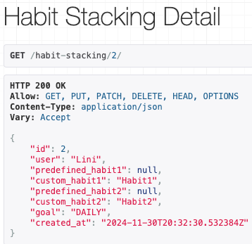

# Manual Testing

## Authorisation

## Profile

## HabitStacking API

| API Endpoint | Test Case | Expected Outcome | Actual Result |
| ------------ | --------- | ---------------- | ------------- |
|POST `/habit-stacking/`| Users can select predefined habits while creating their habit stacks. | Successful creation of a habit stack with predefined habits. | |
|POST `/habit-stacking/`| Users can have the option to enter custom habits manually. | Successful creation of a habit stack with custom habits. ||
|POST `/habit-stacking/`| If the habit stack already exists for the user with the same details, return a 400 Bad Request with a duplicate error message. | Return 400 Bad Request with error message. ||
|POST `/habit-stacking/`| The goal can be set to "DAILY" or "NO_GOAL," with "DAILY" being the default if no goal is specified.| Goal defaults to "DAILY" if not provided.|Goal defaults to "DAILY" if not provided.|
|POST `/habit-stacking/`| Attempt to create a habit stack with both predefined and custom values for a single habit raises an error. | Return 400 Bad Request with validation error message. ||
|GET `/habit-stacking/`| The authenticated user can view a list of all their habit stacks. | Return 200 OK with a list of habit stacks for the logged-in user. ||
|GET `/habit-stacking/`| Habit stacks list includes habit1, habit2, and goal. | Return 200 OK with correct habit details for each stack. |Return 200 OK with correct habit details for each stack.|
|GET `/habit-stacking/{id}/`| The user can retrieve details of their specific habit stack. | Return 200 OK with habit stack details. ||
|GET `/habit-stacking/{id}/`| Return 404 Not Found if the habit stack doesn’t exist.| Return 404 Not Found.||
|PUT `/habit-stacking/{id}/`| The user can update details of their existing habit stacks. | Return 200 OK with updated habit stack details. ||
|DELETE `/habit-stacking/{id}/`| The user can delete their own habit stacks. | Return 204 No Content on successful deletion. ||

# Automated Tests

### HabitStacking List View

| Test | Expected Result | Outcome |
| ---- | --------------- | ------- |
| `test_habit_stacking_list_view_authenticated` | Should return a list of habit stacks for the authenticated user |PASS|
| `test_habit_stacking_list_view_unauthenticated` | Should return `403 Forbidden` when an unauthenticated user tries to access |PASS|
| `test_create_habit_stack` | Should create a new habit stack for the authenticated user |PASS|
| `test_create_habit_stack_validation_error` | Should return `400 Bad Request` for invalid habit stack data |PASS|
| `test_create_habit_stack_unauthenticated` | Should return `403 Forbidden` when trying to create a habit stack without authentication |PASS|

### habitStacking Detail View

| Test | Expected Result | Outcome |
| ---- | --------------- | ------- |
| `test_habit_stacking_detail_view_authenticated` | Should return details of the habit stack for the authenticated user |PASS|
| `test_habit_stacking_detail_view_unauthenticated` | Should return `403 Forbidden` when an unauthenticated user tries to access |PASS|
| `test_habit_stacking_detail_view_forbidden` | Should return `403 Forbidden` if the habit stack belongs to another user |PASS|
| `test_update_habit_stack` | Should update the habit stack with new data |PASS|
| `test_update_habit_stack_forbidden` | Should return `403 Forbidden` when trying to update someone else’s habit stack |PASS|
| `test_delete_habit_stack` | Should delete the habit stack and return `204 No Content`|PASS|
| `test_delete_habit_stack_forbidden` | Should return `403 Forbidden` when trying to delete someone else's habit stack |PASS|

